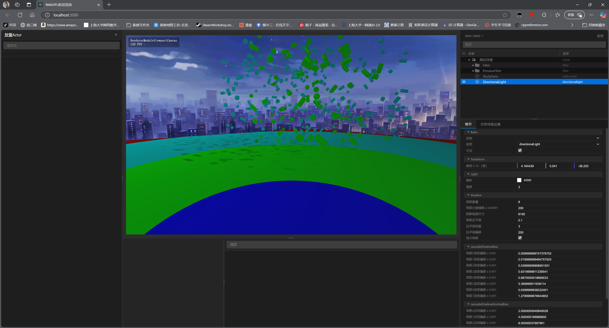

# WebGPU Deferred Rendering

一个基于 WebGPU 的延迟渲染项目。

## 项目预览

### 1. 操作界面
  

  
### 2. 常见材质
- 较为粗糙的金属材质
  

- 光滑金属球
    

- 《皱巴巴的锡箔纸》
  

- 石材
  

### 3. 场景及部分技术展示
- 场景
  

- 场景GBuffers
  

- 场景中CSM (Cascade Shadow Map)
  

- 几何体控制
  

## 项目内容简述

### 1. 项目结构
   -项目采用模块化结构，主要分为以下几个模块：
   -UI模块：负责管理UI界面和交互
   -Renderer模块：负责管理渲染器
   -Resource模块：负责管理渲染器使用的资源
  具体结构如图所示
  

### 2. 核心模块 RenderModule
    - 负责渲染循环
    - 负责场景渲染
    - 调度渲染pass
  功能结构如图所示
  

### 3. 延迟渲染管线的设计
   - 延迟渲染管线分为以下几个pass：
     - 预处理pass （Early Z pass）
     - 几何处理pass （Base Pass）
     - 光照处理pass （DynamicLightPass+LightAndShadow Pass）
     - 后处理pass （PostProcess Pass）
     - 转换格式显示到屏幕上
   - 管线结构如图所示
   

### 4. UI模块(基于React)
   - 负责管理UI界面和交互
   - 功能包含：
     - 场景交互
     - 数据实时修改
     - 场景对象参数设置
     - 场景对象添加
     - 场景对象删除
 - 模块设计如图
   

## 项目使用的外部库
- React
- Three-FBX-Loader

## 运行此项目

确保您的开发环境中已安装以下工具：

- Node.js (推荐 v14.0.0 或更高版本)
- npm (Node.js 包管理器)

### 项目启动

在项目目录下，您可以运行：

#### `npm install`

安装项目所需的所有依赖包。

#### `npm start`

启动开发服务器，运行应用程序。\
在浏览器中打开 [http://localhost:3000](http://localhost:3000) 查看应用。

当您修改代码时，页面将自动刷新。\
您也可以在控制台中查看任何代码错误。

#### `npm run build`

将应用程序构建到 `build` 文件夹中，为生产环境做好准备。\
构建后的文件已经过优化，可以获得最佳性能。

